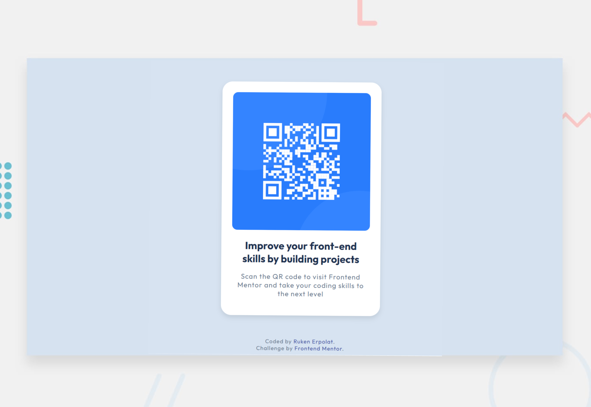
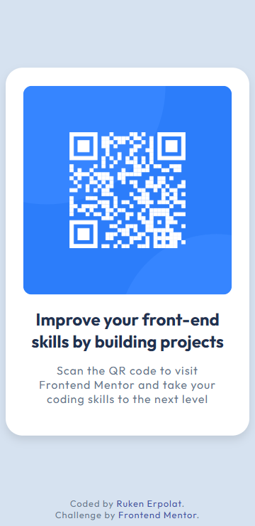

<h1 align="center">Frontend Mentor | QR Code Component</h1>

<div align="center">

This is a solution to the [QR code component challenge on Frontend Mentor](https://www.frontendmentor.io/challenges/qr-code-component-iux_sIO_H). Frontend Mentor challenges help you improve your coding skills by building realistic projects. 

🌐 [View Live Page]()  

</div>



## Built With

✦ HTML5    
✦ CSS3 - Responsive | Flexbox       
✦ Google Fonts - [Outfit](https://fonts.google.com/specimen/Outfit) 

|Mobile Design               |
| -------------------------- |
||

 
##  Project Structure

```
📂qr-code-component
│   
├── assets/
│   └── images/...
│   
├── css/
│   └── style.css   
│   
├── index.html      
├── .gitignore      
└── README.md       
```

<br>

> Thank you for your visit! ♡

<b><em>Ruken ERPOLAT</em></b>    

[](https://linkedin.com/in/rukenerpolat)
[](https://medium.com/@rukenerpolat)
[](https://github.com/rukenerpolat)
[](https://www.frontendmentor.io/profile/rukenerpolat)